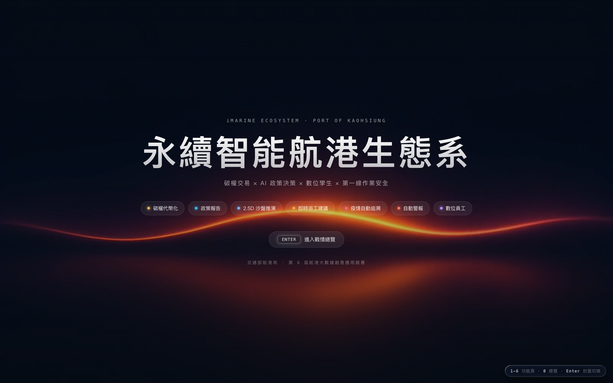
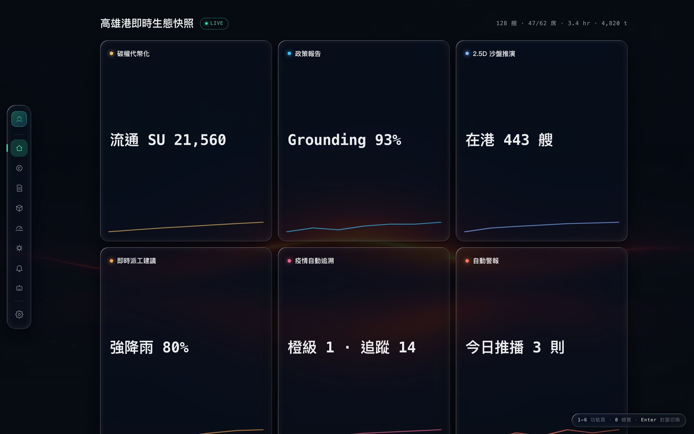
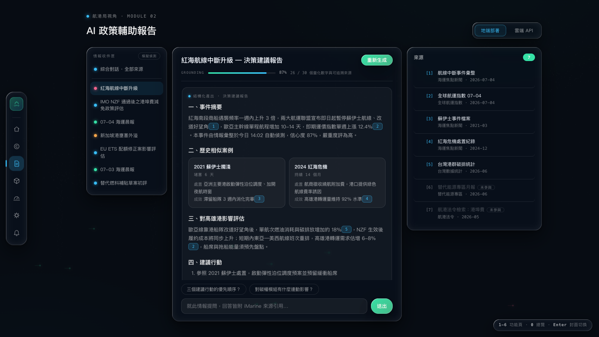
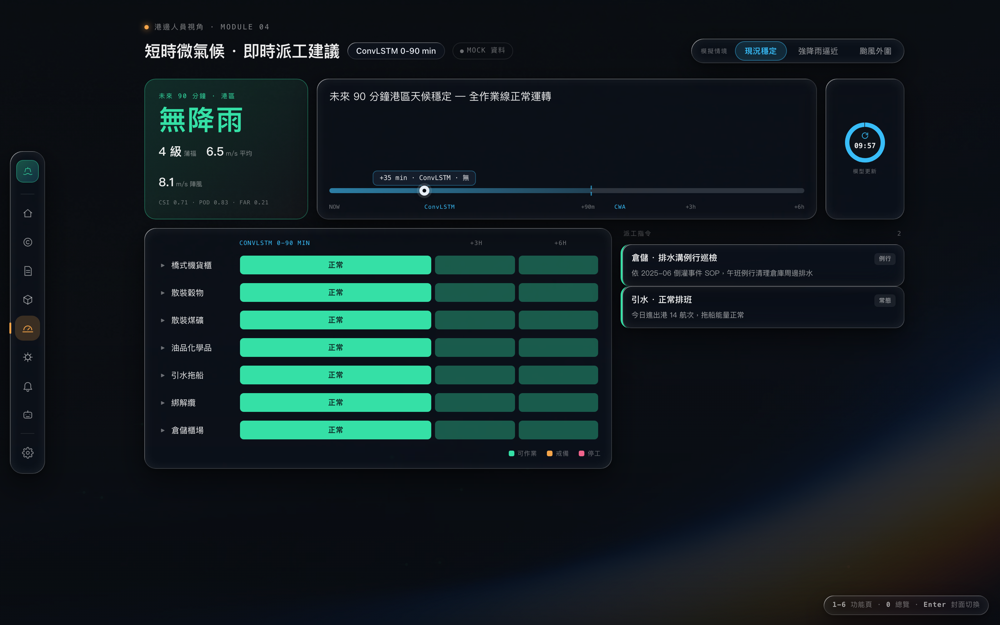
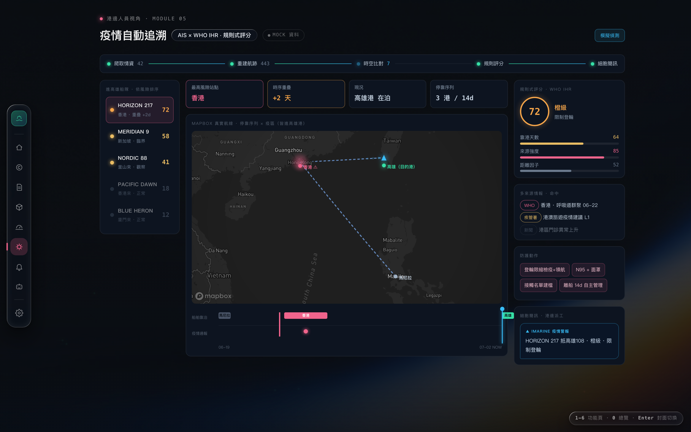
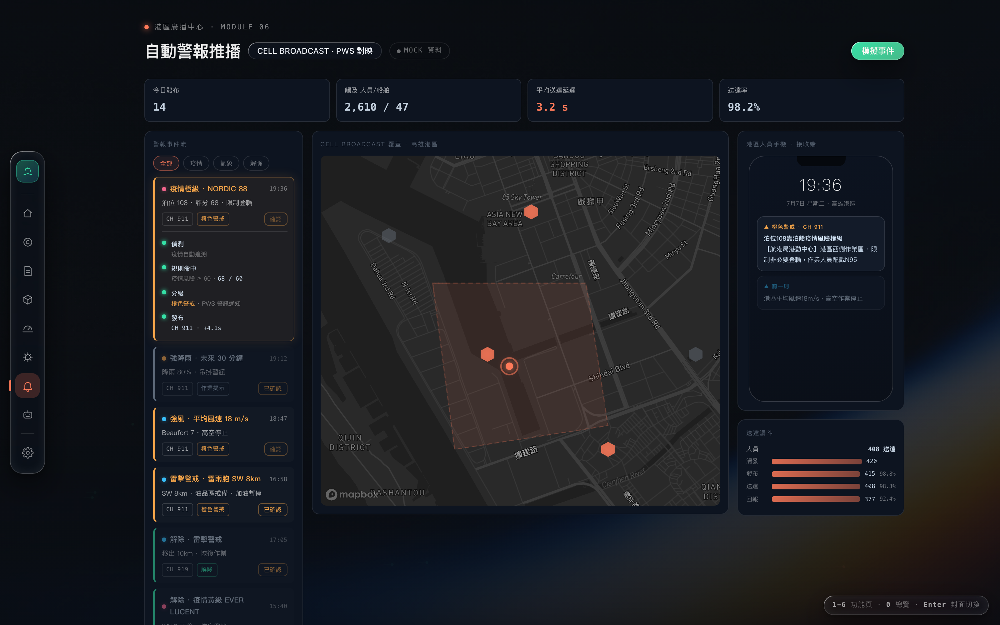
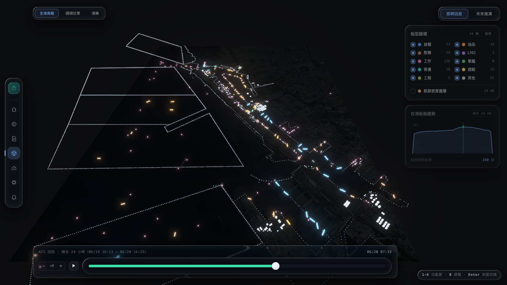
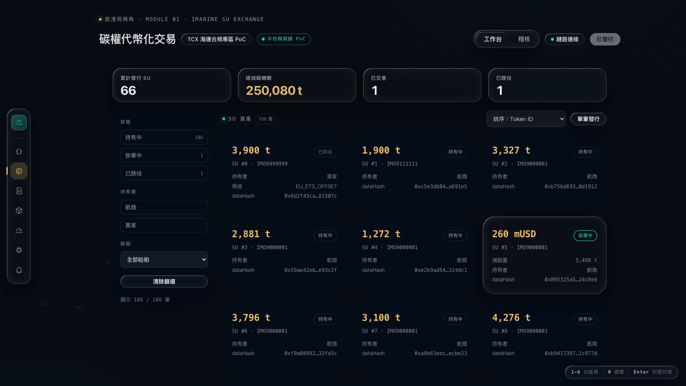
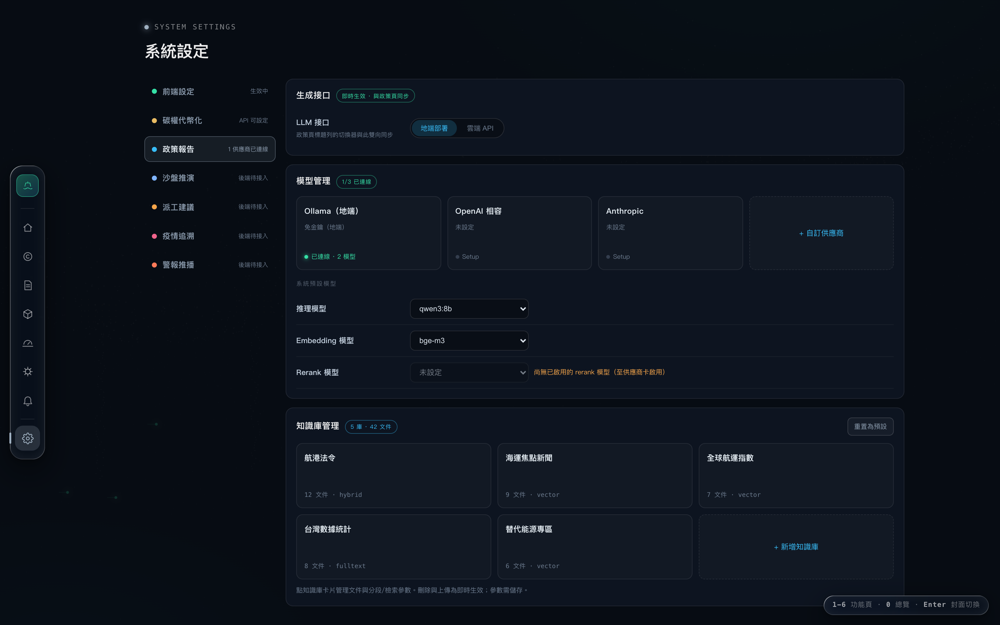
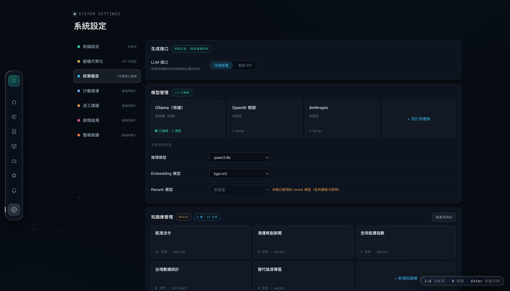

# iMarine-FrontEnd

「永續智能航港生態系」前端整合層——2026 航港大數據創意應用競賽的簡報 + 現場 demo 用 shell。
Vite + vanilla TypeScript（不使用框架）打造，深色 Liquid Glass 設計語言，左側玻璃 icon rail
串接 7 個畫面：封面／戰情總覽（`hero`，兩段式）、碳權代幣化交易（`carbon`）、AI 政策輔助報告
（`policy`）、2.5D 數位孿生沙盤推演（`twin`）、短時微氣候即時派工（`dispatch`）、疫情自動追溯
（`epidemic`）、自動警報推播（`alert`）。

本專案是競賽用的展示殼層，非正式產品；`carbon`／`twin` 兩頁串接真實後端（live provider），其餘
四頁使用 mock 資料（`src/data/mock/*.json`）。

## 畫面展示

封面／戰情總覽、主要模組頁與系統設定頁的實機畫面（逐頁標註資料源）：

### 封面 · 戰情總覽（`hero`，兩段式）

競賽 PPT 開場封面 →按 `Enter`／點「進入戰情總覽」→ 戰情總覽，兩段共用一支全螢幕波浪 loop 影片
底圖（封面明亮、總覽罩幕壓暗，切換時元件 stagger 進場、影片持續播放不換底圖）。封面為電影感
中置標題 + 六大功能模組色點 chips（可點直接進入該模組）+ `ENTER` 快捷提示；戰情總覽為六模組
儀表牆（每張卡：模組色點 + 名稱 + 關鍵指標 + 迷你趨勢線，點卡跳頁），頂部一行即時 KPI（今日
進出港船舶／在泊船席／平均等候／今日預估碳排）。以「大螢幕遠觀、單一 CTA、緩慢大週期背景
動態、文字恆靜」為開場設計語言。





> 封面文案與六模組入口為靜態；戰情總覽的 KPI 與六模組指標綁 overview mock provider。底圖為自架
> 的抽象波浪 loop 影片（`src/screens/hero/hero-bg.mp4`，無縫循環、離線內建、無需連網取用）。

### AI 政策輔助報告（`policy`）

NotebookLM 式三欄政策情報中心：左側情報收件匣（突發事件／新政策／每日晨報三類，可模擬偵測
新情報流入）、中欄對話串（結構化產出報告卡 + 「看得見 AI 在工作」四步驟生成過程 + 追問對話）、
右側 iMarine 五類來源清單（勾選與引用連動）；頂部「綜合對話」進入跨情報知識庫模式（來源聯集
分組摺疊 + 搜尋 + 跨情報提問），並可切換地端／雲端 LLM 接口。以 LLM + RAG 結合 Grounding
事實基礎驗證為設計語言。



> 本頁為 mock 資料的完整互動展示（版面與互動皆已就緒）；正式版只需把 provider 由 mock 換成
> LLM + RAG 後端即可上線。

### 短時微氣候 · 即時派工建議（`dispatch`）

港邊第一線視角：以 ConvLSTM 產出未來 0–90 分鐘港區微氣候預測（六級雨量分級 + 蒲福風級 +
10 分鐘平均風速／陣風），90 分鐘後銜接中央氣象署預報（+3h／+6h），時間軸以「近密遠疏」呈現
雙資料源。左側依當前預測給出七類碼頭作業（橋式機／散裝穀物／散裝煤礦／油品化學品／引水拖船／
綁解纜／倉儲櫃場）的可作業／戒備／停工燈號矩陣，點列可原位展開派工建議的規則依據（區分官方
法規條號與業界慣例）；右側為派工指令卡。可切換三種天氣情境（現況穩定／強降雨逼近／颱風外圍），
全頁連動重算。以「規則引擎可解釋」為設計語言——調度員看得懂系統為什麼這樣建議。



> 本頁為 mock 資料的完整互動展示；規則庫依據勞動部強風／大雨函釋、高雄港風災防救作業要點、
> 中央氣象署雨量分級等實際規範建立。正式版只需把 provider 由 mock 換成 ConvLSTM 預測 +
> 氣象署 API 後端即可上線。

### 疫情自動追溯（`epidemic`）

港邊第一線視角：自動整合進港船隻的過去 AIS 資料重建停靠港口序列，交叉比對船舶航跡與 WHO／
疾管署／國際新聞的疫情通報時序，判定「近期停靠港是否出現疫情、航跡是否與通報時序重疊」，建立
擴散預警並以細胞簡訊通知港邊作業人員。左側為進高雄港船隊清單（依規則式評分風險排序，常態壓灰、
風險發亮）；中央為 Mapbox 真實世界地圖（船舶沿真實航線收束至高雄港，疫區熱點標示）＋下方
Epi-Gantt 雙泳道（船舶靠泊 × 疫情通報，時空重疊即畫命中連接線），共用一條可拖曳的時間游標——
拖動時船舶沿真實航線移動、越過命中時刻脈衝示警；右側為規則式評分卡（依 WHO《國際衛生條例》
框架的靠港天數／來源強度／距離因子）、多來源情報、防護動作與細胞簡訊。頂部自動化管線帶演出
「爬取情資→重建航跡→時空比對→規則評分→細胞簡訊」五階段，並可「模擬偵測」新疫情通報流入
（升級既有船隻風險／新增高風險進港船）。以「規則式評分可解釋、新病原只需補規則」為設計語言。



> 本頁船隊／疫情通報／評分皆為 mock（船名為虛構），地圖底圖為 Mapbox 真實磚；正式版只需把
> provider 由 mock 換成 AIS ＋ WHO／疾管署情資後端即可上線。地圖需在 `.env` 設
> `VITE_MAPBOX_TOKEN` 並於執行時連網取磚。

### 自動警報推播（`alert`）

港區廣播中心：疫情追溯／即時派工／氣象監測等模組產生的港區事件，經分級規則引擎後以細胞廣播
（Cell Broadcast，同災防告警 PWS 技術）推播給港區人員與船舶。左側為警報事件流（事件卡帶來源
模組色點與港區三級分級——紅色警報／橙色警戒／作業提示，對映 PWS 訊息碼徽章 `CH 4371`／`911`／
`919`，點卡可原位展開「偵測 → 規則命中 → 分級 → 發布」的分級軌跡）；中央為 Mapbox 高雄港覆蓋
地圖（基地台 cell 逐一點亮、地理圍欄與波紋擴散示意廣播覆蓋範圍）；右側為港區人員手機端（依分級
呈現通知橫幅或全螢幕緊急插播）與送達漏斗（觸發 → 發布 → 送達 → 回報，紅色警報時人員／船舶雙軌）。
可「模擬事件」演練全鏈路推播（作業提示雷擊 → 紅色警報颱風頂格）。常態壓灰、警報發亮的引導性配色，
資訊以數據／徽章／色彩呈現而非散文。下圖為紅色警報頂格（全港廣播）畫面：



> 本頁事件流／覆蓋範圍／送達統計皆為 mock，地圖底圖為 Mapbox 真實磚；正式版只需把 provider 由
> mock 換成事件匯流 ＋ 細胞廣播發布後端即可上線。地圖需在 `.env` 設 `VITE_MAPBOX_TOKEN` 並於
> 執行時連網取磚。

### 2.5D 數位孿生沙盤推演（`twin`）

高雄港原生 3D 場景（LiDAR 引擎直繪，無 iframe、無外部服務）：航照底圖 + 依船種上色的
AIS 船舶點雲；雙分頁戰情室（即時回放＝過去 24 小時 443 艘真實 AIS 航跡回放／未來推演＝
沙盤模擬）；右側船型篩選、在港趨勢、視角預設、底部時間軸。



### 碳權代幣化交易（`carbon`）

串接碳權 PoC 後端（FastAPI + 本地模擬鏈）的即時資料：累計發行 SU、總減碳噸數、
已交易／已除役統計，與 108 筆 SU 資產卡（真實 `dataHash`、狀態、持有者）。



### 系統設定（`settings`）

全站前後端設定頁（左側 rail 底部齒輪進入，快捷鍵 `7`）：schema 驅動的設定框架，左欄七個分區
（前端設定 + 六大功能模組後端），右側依分區呈現。前端設定分區管資料源總覽、動態效果、Mapbox
token；碳權分區管 API 端點與連線測試；政策報告分區是完整互動的 LLM 應用設定——模型管理（供應商
卡牆 + API 金鑰設定 + 測試連線 + 系統預設推理／Embedding／Rerank 模型）與知識庫管理（多知識庫、
文件上傳、chunk 分段、檢索策略 vector／full-text／hybrid 漸進揭露）；其餘四個模組分區為「後端待
接入」的預留骨架。設定落地 localStorage 並有限生效（政策頁地端／雲端切換與此雙向同步、Mapbox
token 與碳權 API 端點可覆寫 `.env`、減少動態效果全站生效）。



> 本頁為協作框架：其他人的後端整合進來時，只要在 `src/screens/settings/sections/<模組>.ts` 加一筆
> schema 物件即可長出對應設定欄位，無需碰 UI 程式碼（詳見下方「協作者指南」）。政策報告分區的
> 模型／知識庫管理為完整互動 mock，介面形狀依未來 REST API 設計，換接真後端只需替換 provider。

政策報告分區的模型／知識庫管理已可接 **rag-agent** 後端（見「Live Demo 前置作業」）：後端在時走
真實知識庫與模型連線，**後端不在時退回完整 mock 示範**——五庫卡牆（`MOCK` 標記）、檢索策略
vector／full-text／hybrid、rerank 導引、測試連線示範驗證皆可離線操作。



## 安裝與啟動

```
npm install
npm run dev
```

`npm run dev` 啟動 Vite dev server（預設埠 5173），瀏覽器開啟顯示的網址即可看到封面畫面。

其他常用指令：

| 指令 | 用途 |
|---|---|
| `npm run build` | 產出靜態檔於 `dist/`（正式簡報機打包用） |
| `npm run test` | 執行 vitest 單元測試 |
| `npm run preview` | 預覽 `npm run build` 的產出 |

## 環境變數（.env）

先複製範本：

```
cp .env.example .env
```

`.env` 內有三個變數：

| 變數 | 說明 | 預設值 |
|---|---|---|
| `VITE_CARBON_API` | 碳權代幣化交易 PoC 後端（FastAPI）位址 | `http://127.0.0.1:8000` |
| `VITE_MAPBOX_TOKEN` | 疫情自動追溯頁 Mapbox 地圖的 access token（`pk.` 開頭公開 token） | （無，需自行填入） |
| `VITE_POLICY_API` | 政策報告（policy 綜合對話 + settings 政策報告分區）rag-agent 後端位址；未起則走 mock 示範 | `http://127.0.0.1:8100` |

`VITE_CARBON_API` 服務若未啟動，碳權頁連線 chip 會轉紅並提示，不會讓整個 shell 崩潰；twin
頁不依賴任何環境變數（詳見下方「Live Demo 前置作業」）。`VITE_MAPBOX_TOKEN` 未設定時，疫情
頁地圖區會顯示提示卡、頁面其餘部分照常運作（優雅降級，不崩）；填入後地圖於執行時連網取磚。
`.env` 已列入 `.gitignore`，token 不會進版控。

## Live Demo 前置作業

功能頁中，**碳權代幣化交易（carbon）** 與 **AI 政策輔助報告（policy）／系統設定的政策報告分區**
需要先啟動上游服務才能看到「真實資料」而非示範畫面；twin 模組已原生內建，無需任何前置作業（見下）。

### 碳權代幣化交易（carbon）

carbon 呼叫的 **iMarine-Carbon-Tokenization-POC** 是本專案之外的獨立 repo，本專案僅呼叫其
API，不修改其原始碼。依序執行：

```
make chain
make deploy
make api
```

`make chain` 啟動本地 Hardhat 節點、`make deploy` 部署合約、`make api` 啟動 FastAPI 後端
（預設埠 8000，對應 `VITE_CARBON_API`）。三者都要跑起來，carbon 頁才能完成發行、掛單、購買、
除役等完整流程。

### AI 政策輔助報告（policy）／系統設定 · 政策報告分區

policy 頁的「綜合對話」與系統設定「政策報告」分區（模型管理、知識庫管理）接 **rag-agent** 後端
（`VITE_POLICY_API`，預設 `http://127.0.0.1:8100`）：綜合對話走 `/api/chat` 附引用回答、知識庫
管理列真實知識庫與上傳文件、模型管理測真實連線。**後端未啟動時全數優雅退回完整 mock 示範**——
知識庫呈五庫卡牆（帶 `MOCK` 標記）＋檢索策略／rerank／hybrid 互動、測試連線走示範驗證、綜合對話
以情報聯集回答，離線也能完整 demo。收件匣情報本就是 mock 展示，不受後端影響。rag-agent 的取得
與啟動請洽負責該後端的協作者。

### 2.5D 數位孿生（twin）

twin 模組已內建 LiDAR 引擎與真實 AIS/泊位資料，`npm run dev` 即可，無需額外服務。

## 鍵盤快捷鍵（簡報用）

| 按鍵 | 動作 |
|---|---|
| `0` | 回到 hero 戰情總覽 |
| `1`–`6` | 依序跳至 碳權／政策／孿生／派工／疫情／警報 六個功能頁 |
| `Enter` | 僅在 hero 頁生效：於封面（COVER）與戰情總覽（OVERVIEW）之間切換 |

## 瀏覽器需求

介面的玻璃質感（Liquid Glass 折射效果）**僅在 Chromium 系瀏覽器（Chrome／Edge）完整支援**，
簡報與 demo 請使用 Chromium 系瀏覽器開啟。其他瀏覽器會自動降級為磨砂玻璃效果，功能不受影響，
但視覺效果會打折扣。

## 協作者指南

左側 rail 底部的「系統設定」（`settings`）頁是 schema 驅動的設定框架：協作者要幫自己負責的
模組（twin／dispatch／epidemic／alert）新增或調整設定欄位，**不需要碰任何 UI 或渲染程式碼**，
只要編輯自己模組的 `src/screens/settings/sections/<模組>.ts`。本章同時是「新模組主頁面」PR 的
檢查基準（見第 4 節）。

### 1. 新增／刪除設定欄位

每個模組一個檔案：`src/screens/settings/sections/<模組>.ts`，匯出一個 `SettingsSection`
（型別定義在 `src/screens/settings/schema.ts`）。一個 section 底下有多個 `SettingGroup`（卡片），
一個 group 底下有多個 `SettingField`（欄位）。

`SettingField` 是 8 種 kind 的 discriminated union：

| kind | 用途 | 必要屬性 | 常用可選屬性 |
|---|---|---|---|
| `text` | 單行文字輸入 | `key`、`label` | `placeholder`、`help`、`disabled` |
| `password` | 遮罩輸入；已存值只顯示尾四碼，按「更換」才重新輸入、「清除」需 confirm | `key`、`label` | `help`、`disabled` |
| `select` | 下拉選單，`options` 是函式（可回傳動態來源，如「已連線供應商的已啟用模型」聯集） | `key`、`label`、`options` | `help`、`disabled` |
| `toggle` | 開關 | `key`、`label` | `help`、`disabled`、`defaultOn` |
| `number` | 數字輸入 | `key`、`label` | `min`、`max`、`step`、`help`、`disabled` |
| `slider` | 滑桿 | `key`、`label`、`min`、`max` | `step`、`disabled` |
| `action` | 按鈕觸發非同步動作（如「測試連線」），`run` 回傳 `Promise<ActionResult>`，驅動 idle/執行中/成功/失敗四態 UI | `label`、`button`、`run` | `disabled`（**沒有 `key`**，不寫入 storage、不受下方重複 key 檢查） |
| `note` | 純文字提示，不參與讀寫 | `text` | — |

可複製範例（一個 `text` + 一個 `toggle`，示範兩種 `saveMode`）：

```ts
// src/screens/settings/sections/dispatch.ts
import type { SettingsSection } from '../schema';

export const dispatchSection: SettingsSection = {
  id: 'dispatch',
  label: '短時微氣候即時派工建議',
  color: '#F5A54A',
  status: () => '後端待接入',
  groups: [
    {
      title: '推論服務',
      saveMode: 'explicit', // 文字欄位群：改字 → 浮出「未儲存變更」列 → 按「儲存」才寫入 + 生效
      fields: [
        { kind: 'text', key: 'dispatch.inferenceEndpoint', label: 'ConvLSTM 推論端點', placeholder: 'https://...' },
      ],
    },
    {
      title: '通知',
      saveMode: 'instant', // toggle/select/slider：撥動當下即寫入 storage + 立即生效，無儲存鈕
      fields: [
        { kind: 'toggle', key: 'dispatch.autoNotify', label: '自動派工通知', defaultOn: true },
      ],
    },
  ],
};
```

`saveMode` 是 group 層級的屬性，同一個 group 不要混用 `instant`／`explicit`（toggle/select/slider
用 `instant`，text/password/number 這類需要「確認才送出」的欄位用 `explicit`）。`key` 是
storage 路徑，命名規則固定為 `<模組>.<欄位>`（如 `dispatch.autoNotify`），**全站所有 section
共用同一個扁平命名空間**，跨模組也不能重複。

寫完 section 後要在 `src/screens/settings/index.ts` 的 `SECTIONS` 陣列加入你的 import；
**刪除欄位＝從 `fields` 陣列刪掉那個物件**，刪整個 group／整個 section 同理刪對應物件／檔案
＋ `index.ts` 的 import 與陣列項。storage 是扁平 key→value，刪欄位後殘留的舊 key 不會報錯，
單純不再被讀取。

`key` 重複的提醒：`validateSections(SECTIONS)` 在 `index.ts` 的 `mount()` 執行一次，掃描所有
帶 `key` 的欄位（`action`／`note` 沒有 `key`，不列入檢查），一旦同一個 key 出現兩次就直接
`throw new Error('settings schema: duplicate key "..."')`——整個設定頁會在載入期掛掉，
方便在開發階段就抓到而不是流到 demo 現場。單元測試 `tests/settings-schema.test.ts` 涵蓋此行為。

### 2. 讀取設定值

跨頁讀寫走 `src/screens/settings/storage.ts` 這三個 API（單一 localStorage key
`imarine.settings.v1`）：

```ts
import { getSetting, setSetting, subscribe } from '../settings/storage';

getSetting('dispatch.autoNotify', true); // storage 有值就回，否則回傳第二參數 fallback
setSetting('dispatch.autoNotify', false); // 寫入 + 通知所有訂閱該 key 的 callback
const unsub = subscribe('dispatch.autoNotify', (v) => { /* … */ }); // 回傳取消訂閱函式
```

實例是 `policy.llmMode`（地端／雲端 LLM）在設定頁與 policy 頁之間的雙向同步
（`src/screens/policy/index.ts`）：policy 頁初始化讀 `getSetting('policy.llmMode', 'local')`，
使用者在 policy 頁切換 segmented 時 `setSetting('policy.llmMode', llm)` 回寫；同時
`subscribe('policy.llmMode', cb)` 監聽設定頁那邊的變更並跟著切換 segmented 樣式（用值比對
避免自己觸發自己造成的震盪）。重新整理頁面後兩邊都讀到同一份 storage，狀態不丟。

同檔的 `prefersReduced()` 是所有頁面「減少動態效果」判斷的唯一入口（設定頁覆寫優先，其次
`matchMedia('(prefers-reduced-motion: reduce)')`）——新頁面的 reduced-motion 分支一律呼叫
這個 helper，不要自己重寫 `matchMedia` 判斷。

### 3. mock → live

資料交換層的 provider 介面（`src/data/types.ts`）：

```ts
export type Source = 'live' | 'mock';
export interface Provider<T> {
  readonly source: Source;
  snapshot(): Promise<T>;
}
```

mock provider（`src/data/exchange/mock.ts` 的 `mockProvider(data)`）把靜態 JSON 包成
`Promise`；live provider（`src/data/exchange/carbon.ts` 的 `createCarbonProvider(base)`）
真的呼叫後端 API。**換接真後端只需要改 `src/data/exchange/` 底下對應模組的檔案**（把
`mockProvider(dispatchJson)` 換成一個實作 `Provider<DispatchSnapshot>` 的函式），screen
程式碼與 UI 完全不動——因為 screen 永遠只呼叫 `ctx.data.<模組>.snapshot()`，不在乎背後是
mock 還是 live。

policy 模組進一步示範 **live 優先、後端不在時退回 mock** 的雙態：`src/data/exchange/policy.ts`
的 provider 有 `chat()`／`knowledgeBases()` 等方法打 rag-agent，呼叫端以 `try/catch` 包裹，後端
不在時退回完整 mock 示範（`src/screens/settings/sections/policy-kb-mock.ts` 的 `mountMockKb()`）。
協作者的模組若想「後端未接時仍能離線 demo」，可比照這個 fallback 形狀。

設定頁 `action` 欄位的 `run()` 怎麼指到真端點，可參考 `src/screens/settings/sections/carbon.ts`
的 `testCarbon()`：真打 `fetch(base + '/health')`（帶 `AbortController` 逾時），**永遠 resolve
成 `ActionResult`、絕不 throw/reject**（成功與失敗都包進 `try/catch` 回傳 `{ok, message}`），
這樣 renderer 的 action 四態 UI（執行中 → 成功／失敗）才不會卡死。協作者的模組要接真的
「測試連線」時比照這個形狀寫。

**API key 只送不回**：mock 階段為了 demo 方便，key 是明文存在 localStorage（`password` 欄位
用 `tail4()` 只在畫面上顯示尾四碼，不代表儲存有遮罩）；真後端接上時，後端回傳的設定物件裡
**永遠是 masked key**（如 `sk-***abcd`），前端不應該把畫面上顯示的遮罩值當作真 key 再送出去。
這個介面形狀已經寫進 policy 模型管理的資料契約設計（見
`docs/superpowers/specs/2026-07-07-settings-page-design.md` §6.2 的 `PolicyBackendSettings`），
其他模組接後端時比照辦理。

### 4. 前端頁面設計規範（PR 檢查基準）

新增一個模組主頁面（如佔位頁轉正）或改動既有頁面時，以下四類是 review 的檢查基準。

**技術契約**：
- `Screen` 介面（`src/screens/types.ts`）三段生命週期：`mount(el, ctx)` 每個 screen 只呼叫
  一次（首次進入）；`show()` 每次切入呼叫（含首次，在 `mount` 之後）；`hide()` 切出呼叫，
  **DOM 保留、不銷毀**。
- 檔案結構固定 `src/screens/<id>/{index.ts, <id>.html, <id>.css}`。
- CSS 全部選擇器加 `#s-<id>` 前綴，避免跨頁樣式外漏（既有真實案例：policy 頁的 `.gbar` 曾被
  孿生模組未加前綴的同名規則污染，教訓見 `HANDOFF.md`）。
- canvas／尺寸依賴的重繪要綁在 `show()`，不要放在只跑一次的 `mount()`。
- 計時器／`setTimeout`／`requestAnimationFrame` 一律在 `hide()` 清除（實例：
  `src/screens/epidemic/index.ts` 的 `hide()` 清 `autoFlowTimer`／`pipeTimer`），避免離開頁面
  後背景還在跑、回來時重複觸發。
- reduced-motion 分支一律呼叫共用的 `prefersReduced()`（見第 2 節），不要自己重寫
  `matchMedia` 判斷。

**設計系統**：
- 元件一律用 Liquid Glass Kit（`src/ui/liquid-glass.css/js`），**不手寫 `backdrop-filter`**——
  折射效果由 Kit 的 JS 對帶 `data-lg` 的元素注入，自己寫的 `backdrop-filter` 會被蓋掉或製造
  不一致的降級行為。
- 小型／大量重複的元件用 `.lg-static`（輕量玻璃降級，不即時折射）。
- 儀表／統計類元件的原則是「玻璃容器 + 實心內容」，不要整塊都做成半透明。
- design tokens：底色 `#070b11`、主色 `--lg-accent:#35E0A6`、金 `#E9BC63`、資訊藍 `#38BDF8`、
  警示玫紅 `#F0648C`；髮絲線 `rgba(255,255,255,.1)`；字體 Inter／Noto Sans TC + Geist Mono。
- 各模組輔助色（`src/shell/registry.ts` 的 `color` 欄位）：碳權金 `#E9BC63`、政策青 `#38BDF8`、
  孿生藍 `#7FB4FF`、派工琥珀 `#F5A54A`、疫情玫紅 `#F0648C`、警報橘紅 `#FF7A59`、系統設定
  銀灰 `#9FB0C0`。**使用限制**：這些顏色只用在 rail active 光條、`screenHeader()` 的 eyebrow
  圓點、徽章（badge/chip）這三處，不要拿去做大面積填色或當作內文強調色。

**版面節奏**：
- eyebrow 標頭用 `screenHeader()`（`src/ui/components.ts`）→ 標題列（`badges` 技術徽章 +
  `source`/`sourceLabel` 資料源 chip，未給 `source` 則不顯示，policy／settings 頁是特例不顯示）
  → KPI 統計列用 `statRow()` → 主視覺（左欄 ~62%）+ 右欄卡片；進場用 stagger（`--d` 延遲變數）。
- 背景兩態：空間型頁（hero／twin／dispatch／epidemic）背景亮；文件型頁（carbon／policy／
  settings）用 `data-mode="doc"` 罩幕壓暗——新頁面依內容密度（展演型 vs 表單密集型）挑一種。

**內容原則**：
- mock 頁不是空殼——用報告書 v6 的參考數字做完整假資料版面，之後只把 provider 從 mock 換
  live，UI 不用重做。
- schema／資料型別要跟後端契約走，**不要憑空臆造欄位**；佔位分區（disabled + badge）先畫出
  合理的欄位骨架即可，實際欄位定案要等協作者的後端需求確定。

**新模組頁面 PR 自查清單**：

- [ ] `Screen.mount()` 只做一次性初始化，`show()`/`hide()` 各司其職，`hide()` 後 DOM 未被銷毀
- [ ] 檔案結構為 `src/screens/<id>/{index.ts,<id>.html,<id>.css}`
- [ ] CSS 選擇器全部加 `#s-<id>` 前綴，無外漏規則
- [ ] canvas／尺寸相關重繪綁在 `show()`，不是 `mount()`
- [ ] 所有計時器／rAF 在 `hide()` 清除
- [ ] reduced-motion 分支呼叫 `prefersReduced()`，未自行重寫 `matchMedia`
- [ ] 沒有手寫 `backdrop-filter`，玻璃元件皆出自 Liquid Glass Kit
- [ ] 小型/重複元件用了 `.lg-static`
- [ ] 用了 design tokens（色票/字體），未混入非表列顏色
- [ ] 模組輔助色只用在 rail active／eyebrow 圓點／徽章，未大面積填色
- [ ] 頁面節奏為 eyebrow → 標題列 → KPI → 主視覺+右欄，背景模式（亮/`doc`）選擇有理由
- [ ] mock 資料為完整假資料版面，不是空殼；欄位/型別沒有臆造，跟後端契約一致
- [ ] 新增的設定欄位（若有）key 命名為 `<模組>.<欄位>`，未與既有 key 衝突
- [ ] `npx tsc --noEmit` / `npx vitest run` / `npm run build` 三者皆綠燈
